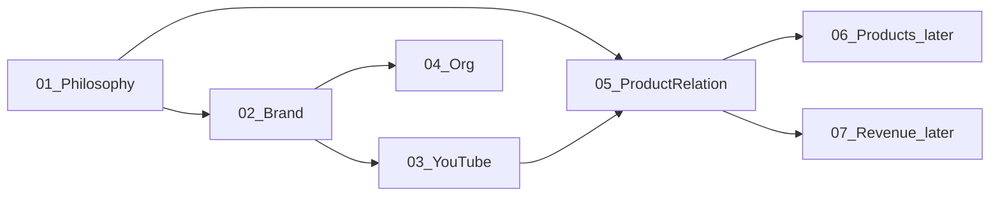
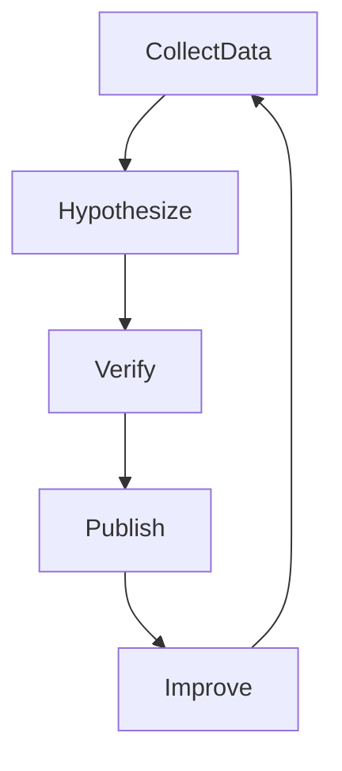

# 00 — 競馬研究所 OS 概要

## 1. これは何か

**競馬研究所 OS（Business Blueprint）** は、競馬メディア事業全体の設計書である。

- 何をやるか / やらないかを決める憲法  
- ブランド・チャンネル・商品・組織の接続図  
- 迷ったときに戻る判断基準  

単なる「今のアイデアメモ」ではない。何年も使う経営OSとして育てる。

## 2. 文書マップ

| ファイル | 役割 | Phase |
|---|---|---|
| [01-philosophy.md](01-philosophy.md) | 理念・動機・境界 | 1 |
| [02-brand-architecture.md](02-brand-architecture.md) | ブランド階層 | 1 |
| [03-youtube-roles.md](03-youtube-roles.md) | YouTube 役割分担 | 1 |
| [04-org-structure.md](04-org-structure.md) | 組織図 | 1 |
| [05-product-relationship.md](05-product-relationship.md) | 商品との関係（骨格） | 1 |
| [later/06-products.md](later/06-products.md) | 商品設計 | 2 |
| [later/07-revenue-model.md](later/07-revenue-model.md) | 収益モデル | 2 |

インタビュー記録は [`interviews/`](interviews/) に保存する。  
未決事項の集約は [`open-questions.md`](open-questions.md)。  
図単体は [`diagrams/`](diagrams/)。  
議論ログは [`sessions/`](sessions/)。

## 3. 事業の一文定義

> 競馬研究所は、競馬を投資的な手法として再現可能にできるかを検証する研究機関であり、  
> YouTube・note・LINE・商品を通じて研究を公開・継続するメディア事業である。

## 4. 媒体の役割（固定）

| 媒体 | 役割 |
|---|---|
| YouTube | 研究発表 |
| note | 研究レポート |
| LINE | 速報 |
| 商品 | 研究成果 |

## 5. 研究サイクル（固定）

## 6. 更新原則

1. **事実と仮説を分ける** — 未検証は「仮説」、確定は「方針」と明記する  
2. **ポリシー順守は非交渉** — 全ブランド共通の制約  
3. **一人運営の上限を守る** — 当面は最大3チャンネル  
4. **ブランド追加は条件付き** — 検証済みの勝ち筋、または担当者確保があるときだけ  
5. **変更はドキュメントから** — 運用の都合で口頭ルールを増やさない  

## 7. Phase 1 の完了定義

- 理念が言語化されている  
- ブランド三層（長期資産 / 実験 / 専門）が定義されている  
- 当面3チャンネルの役割仮説がある  
- 現在→将来の組織図がある  
- 研究と商品の接続点が明記されている  
- 未決事項が一覧化されている  

## 8. 未決事項（OS全体）

- 親ブランド「競馬研究所」の対外正式名称（表記ゆれ・英名の有無）
- 2本目・3本目チャンネルのテーマ最終確定
- 実験ブランドの公開/非公開運用ルール
- 商品の最初の一品（Phase 2）
- 収益配分の数値目標（Phase 2）
