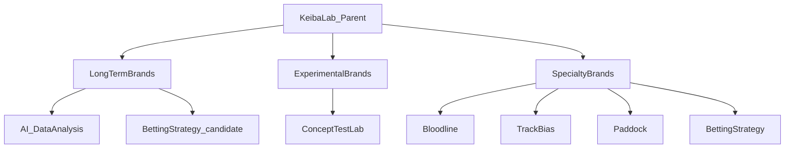

# 02 — ブランド設計（Brand Architecture）

**参照インタビュー:** [interviews/round-02-brand.md](interviews/round-02-brand.md)

## 1. 親ブランド

**競馬研究所**

親ブランドは「研究機関」としての信頼・方法論・世界観を担う。  
個別の YouTube チャンネルや専門メディアは子ブランド。



## 2. 三層モデル

### 2.1 長期資産ブランド

長く育てるブランド。

| 項目 | 定義 |
|---|---|
| 目的 | 信頼と根拠の蓄積 |
| 重視 | 継続性・再現性・ポリシー順守 |
| 出口 | LINE / note / 自社サービス / 商品 |
| 失敗の扱い | 表で訂正し、研究資産に変える |
| 運用頻度 | 安定配信（無理な投稿増産をしない） |

**現時点の主力:** AI × 過去データ分析（既存チャンネル）

### 2.2 実験ブランド

新しい企画・切り口を検証するブランド。

| 項目 | 定義 |
|---|---|
| 目的 | 学習速度の最大化 |
| 検証対象 | タイトル / サムネ / コンセプト / ターゲット / 動画構成 |
| 制約 | ポリシーは守る。信用毀損になる表現は禁止 |
| 成功時 | 長期資産 or 専門ブランドへ昇格 |
| 失敗時 | 学びを記録して終了・改名・再設計 |

実験ブランドは「伸びたらラッキー」ではなく、**比較可能な実験ログ**を残す場所。

### 2.3 専門ブランド

視聴者属性ごとに独立させるブランド。

現時点の候補領域:

1. AIデータ分析  
2. 血統  
3. トラックバイアス  
4. パドック  
5. 馬券戦略  

将来は 10〜20 まで拡張してよい。ただし拡張条件を満たすこと。

## 3. ブランド追加の条件（ゲート）

次の **いずれか必須 + ポリシー確認必須**:

1. 実験ブランドで勝ち筋（需要・維持・導線）が確認された  
2. その領域を担える担当者（自分の余力 or 他者）が確保された  

満たさない追加は禁止。チャンネル数の虚栄を避ける。

## 4. ブランドに持たせる思想テンプレート

各子ブランドは次を1枚で定義する。

```text
ブランド名:
層: 長期資産 / 実験 / 専門
主張:
方法:
対象ペルソナ:
主要なコンテンツ型:
禁止事項:
接続先: YouTube / note / LINE / 商品
成功指標:
```

## 5. 当面のブランド配置（1人運営）

| スロット | 層 | テーマ仮説 | 状態 |
|---|---|---|---|
| A | 長期資産 | AI × 過去データ分析 | 既存・継続 |
| B | 長期資産（専門の芽） | 馬券戦略 / 再現性 | 新設候補 |
| C | 実験 | 血統 or トラックバイアス等を検証 | 新設候補 |

詳細な役割は [03-youtube-roles.md](03-youtube-roles.md)。

## 6. ブランド間の関係ルール

- 親（競馬研究所）は方法論と信頼の傘  
- 子は専門性で差別化し、同一視聴者を食い合う詰め込みをしない  
- 実験の学びは親OSと長期資産へ還元する  
- 商品は原則「長期資産ブランド」から接続する（実験から直販しない）  

## 7. 方針として確定したこと

| 項目 | 方針 |
|---|---|
| 親ブランド | 競馬研究所 |
| 構造 | 長期資産 / 実験 / 専門 の三層 |
| 属人性 | 人物ではなくブランド思想 |
| 拡張上限（将来） | 10〜20 を許容（条件付き） |
| 当面上限 | 3スロット |

## 8. 未決事項

- 子ブランドの正式名称（チャンネル名）
- 実験ブランドを別CHにするか、期間限定ブランドにするか
- 専門ブランドの優先順位（血統 vs バイアス vs パドック）
- ビジュアルアイデンティティ（色・字体・ロゴ方針）※デザインPhase
