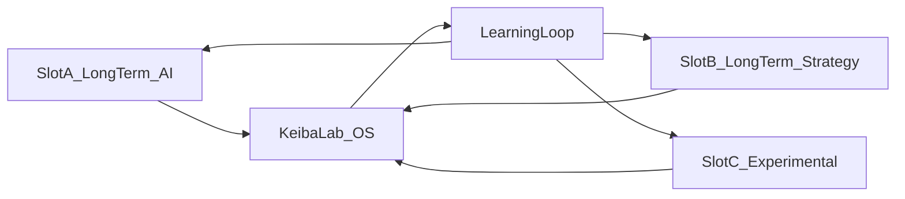

# 03 — YouTube チャンネル役割分担

**参照インタビュー:** [interviews/round-03-youtube.md](interviews/round-03-youtube.md)

## 1. 複数チャンネルの目的

増やしたいから増やすのではない。目的は次の3つ。

1. **視聴者属性の分離**  
2. **実験速度の向上**（伸びない理由の比較分析）  
3. **事業リスクの分散**（単一依存を避ける）  

前提: すべてのチャンネルで YouTube ポリシーを守る。

## 2. 運営上限

| フェーズ | 上限 | 理由 |
|---|---|---|
| 現在（一人） | 最大3 | 品質と研究時間を守る |
| 将来（分業） | 10〜20 可 | 担当者と勝ち筋がある場合のみ |

## 3. 当面3スロット設計

### Slot A — 長期資産（既存）

| 項目 | 内容 |
|---|---|
| コンセプト | AI × 過去データ分析 |
| 役割 | 研究所の主力研究発表 |
| 視聴者 | データ・根拠重視層 |
| コンテンツ | 過去データ適合分析、仮説提示、検証振り返り |
| 出口 | note深掘り / LINE速報 / 将来商品 |
| KPI | 信頼（維持・保存・導線）、研究の継続性 |

### Slot B — 長期資産 / 専門の芽（新設候補）

| 項目 | 内容 |
|---|---|
| コンセプト仮説 | 馬券戦略・再現性・投資的考え方 |
| 役割 | 「どう考えるか」を言語化し、商品導線と接続 |
| 視聴者 | 勝ち方・資金管理・再現性に興味がある層 |
| コンテンツ | 戦略フレーム、検証ログ、失敗分析 |
| 出口 | note有料レポート / 商品の入口 |
| KPI | 導線CV、保存率、コメントの質 |

### Slot C — 実験（新設候補）

| 項目 | 内容 |
|---|---|
| コンセプト仮説 | 血統 / トラックバイアス等をローテーション検証 |
| 役割 | タイトル・サムネ・コンセプト・ペルソナの高速実験 |
| 視聴者 | 実験対象ごとに変動 |
| コンテンツ | 短サイクル企画、比較可能なフォーマット固定 |
| 出口 | 原則なし（学びをOSへ還元）。成功時のみ昇格 |
| KPI | CTR、維持、学習速度（週次実験数と結論数） |

## 4. 比較検証の軸

複数ブランドを持つ意味は、次を並列比較できること。

| 軸 | 見る指標 | メモ |
|---|---|---|
| タイトル | CTR | 同じレース題材でも切り口を変える |
| サムネ | CTR | 情報量 vs 世界観のバランス |
| コンセプト | 登録率・リピート | 「誰のチャンネルか」が伝わるか |
| ペルソナ | コメント属性 | 予想好き / 研究好きの比率 |
| 構成 | 視聴維持 | 前置き・結論・根拠の順番 |

## 5. チャンネル運用ルール

1. Slot A/B は信用資産。煽りで短期最大化しない  
2. Slot C だけが実験場。A/Bに未検証コンセプトを混ぜない  
3. 週次で「仮説→結果→学び」をOSに記録する  
4. ポリシー懸念がある表現は公開前に落とす  
5. 3本を超える新設は組織余力ができるまで禁止  

## 6. 研究発表としての動画要件（全スロット共通）

最低限含める:

- 今回の仮説  
- 使ったデータ / 観察視点  
- 結論（断定しすぎない）  
- 次回検証ポイント  

「当てた/外した」だけで終わらせない。

## 7. 方針として確定したこと

| 項目 | 方針 |
|---|---|
| 当上面数 | 3 |
| Slot A | AIデータ長期資産（既存継続） |
| Slot B | 戦略・再現性（新設候補） |
| Slot C | 実験（切り口検証） |
| 評価 | CTRだけでなく導線と学びも見る |

## 8. 未決事項

- Slot B / C の正式チャンネル名
- Slot C の最初の実験テーマ（血統かバイアスか）
- 投稿頻度の具体数値（週何本）
- 既存チャンネル名と親ブランド「競馬研究所」の表記関係
