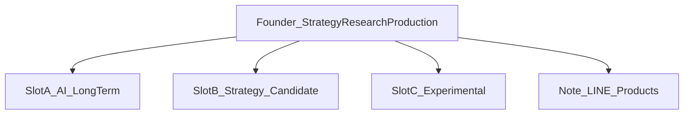
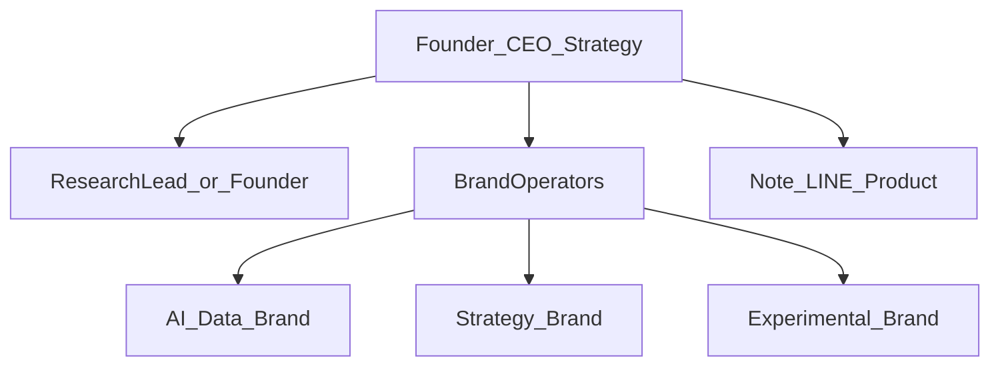
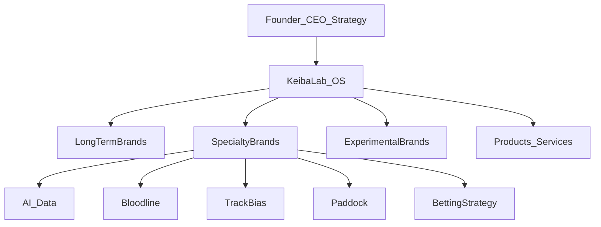

# 04 — 組織図（Organization）

**参照インタビュー:** [interviews/round-04-org-product.md](interviews/round-04-org-product.md)

## 1. 組織の原則

- いまは一人で回る  
- 将来は創業者が経営・戦略、各ブランドに専門家  
- 組織はブランド構造に従う（人に合わせて場当たりで増やさない）  

## 2. 現在の組織（Phase Now）

| 役割 | 担当 | 内容 |
|---|---|---|
| 経営・戦略 | 創業者 | OS更新、ブランド追加判断、優先順位 |
| 研究 | 創業者 | 仮説・検証・データ |
| 制作 | 創業者 | YouTube / note / LINE |
| 収益 | 創業者 | 商品・導線 |

**制約:** 同時稼働チャンネルは最大3。

### 一人運営の時間配分ガイド（仮説）

| 領域 | 目安 |
|---|---|
| 研究（データ・仮説・検証） | 40% |
| 長期資産CH制作（A/B） | 35% |
| 実験CH（C） | 15% |
| OS更新・振り返り | 10% |

数値は運用しながら調整する。

## 3. 近い将来（Phase Team-Small）

少人数で専門を分け始める段階。

| 役割 | 責任 |
|---|---|
| 創業者 | 経営、OS、優先順位、品質・ポリシー最終責任 |
| ブランド担当 | 担当CHの企画・制作・仮説記録 |
| 研究リード | 共通方法論、検証基準、データ品質 |

この段階でも「実験の乱立」は禁止。スロット制を維持する。

## 4. 将来の組織（Phase Media Group）

競馬メディアグループとして、専門ブランドを横に展開する。

| 機能 | 内容 |
|---|---|
| 経営・戦略 | 創業者。どのブランドを育て/閉じるか |
| 専門ブランド担当 | AI / 血統 / バイアス / パドック / 馬券戦略 など |
| 実験ユニット | 新規切り口の検証専任（少人数） |
| プロダクト | 研究成果の商品化・サービス化 |
| 共通基盤 | データ、編集品質、ポリシー、分析 |

最終的に 10〜20 ブランドがあってもよい。  
ただし各ブランドに **担当可能性** と **存在理由** が必要。

## 5. 委任境界

創業者が手放してよいもの / 残すもの。

| 残す（経営） | 委任してよい |
|---|---|
| OSの更新権限 | 各CHの日常制作 |
| ブランド追加・終了 | サムネ/タイトルの実験実行 |
| ポリシー最終判断 | 担当領域のリサーチ |
| 商品化の可否 | 編集・投稿オペレーション |
| 対外の基本思想 | コミュニティ返信の一次対応 |

## 6. 採用・仲間の基準（将来）

- 担当領域の専門性がある  
- 「当てる芸」ではなく検証姿勢を共有できる  
- ブランド思想を守り、属人化を増幅しない  
- ポリシー感覚がある  

## 7. 方針として確定したこと

| 項目 | 方針 |
|---|---|
| 現在 | 創業者一人・最大3CH |
| 移行 | 少人数分業 → 専門ブランド展開 |
| 創業者の将来役割 | 経営・戦略 |
| 組織とブランド | ブランド構造に組織を合わせる |

## 8. 未決事項

- 最初に委任する役割（編集 / リサーチ / 専門のどれか）
- 報酬・役割定義の詳細
- 外部専門家との契約形態
