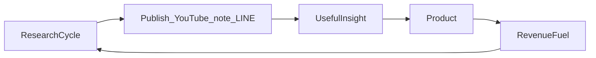

# 05 — 商品との関係（骨格）

**参照インタビュー:** [interviews/round-04-org-product.md](interviews/round-04-org-product.md)

> この文書は商品カタログではない。  
> **研究・メディア・商品がどう接続するか** の骨格だけを定義する。  
> 詳細設計は Phase 2（[later/06-products.md](later/06-products.md)）。

## 1. 基本原則

1. **研究が先、商品は後**  
2. 未検証の手法を完成形として売らない  
3. 商品は「研究成果のパッケージ」である  
4. 実験ブランドから直接売らない（長期資産ブランド経由）  
5. 発信の目的は研究継続。販売はその燃料  

## 2. 価値の流れ

| 段階 | 意味 |
|---|---|
| Research | データ収集・仮説・検証 |
| Publish | 過程と結果の公開 |
| Insight | 他者にも再現可能な知見 |
| Product | 体系化・使いやすくした成果物 |
| Fuel | 研究を続けるための収益 |

## 3. 媒体と商品の役割分担

| 媒体 | 提供する価値 | 商品との関係 |
|---|---|---|
| YouTube | 研究発表（広く浅い〜中程度） | 問題意識と信頼を作る |
| note | 研究レポート（深い） | 有料レポートや商品の前段 |
| LINE | 速報（タイミング） | 実務接点。過度な売り込みをしない |
| 商品 | 研究成果（体系） | 再現手順・ツール・教材など |

## 4. 何が商品候補になるか（骨格）

商品化してよい条件:

- 複数回の検証ログがある  
- 再現手順を第三者向けに書ける  
- 長期資産ブランドの思想と一致する  
- ポリシー・誇大表現のリスクを制御できる  

商品候補の型（詳細は Phase 2）:

1. **研究レポート**（note中心）  
2. **手法パッケージ**（フレームワーク教材）  
3. **データ/ツール**（検証を助ける道具）  
4. **継続コミュニティ/速報**（LINE等。売り方は慎重に）  

## 5. ブランド別の接続

| ブランド層 | 商品接続 |
|---|---|
| 長期資産 | 主接続。信頼を資本に商品化 |
| 専門 | 領域特化商品の将来候補 |
| 実験 | 接続しない。昇格後に検討 |

## 6. 「人のため」との位置づけ

- 最初の目的は自分の仮説検証  
- 役立つ知見が生まれたら提供する  
- だからこそ、煽り販売より **検証可能性** を商品価値にする  

## 7. Phase 2 への引き継ぎ項目

次の文書で決める:

- 最初の一商品は何か  
- 価格帯  
- 無料/有料の境界  
- LINEの役割の具体  
- 収益目標と比率（YouTube広告 vs 商品 等）  

→ [later/06-products.md](later/06-products.md)  
→ [later/07-revenue-model.md](later/07-revenue-model.md)

## 8. 方針として確定したこと

| 項目 | 方針 |
|---|---|
| 順序 | 研究 → 公開 → 商品 |
| 実験からの直販 | しない |
| 商品の本質 | 研究成果の体系化 |
| 収益の意味 | 研究継続の燃料 |

## 9. 未決事項

- 最初の商品の具体
- 有料化の開始条件（検証回数・期間）
- 返金・免責・表現ガイドラインの詳細
