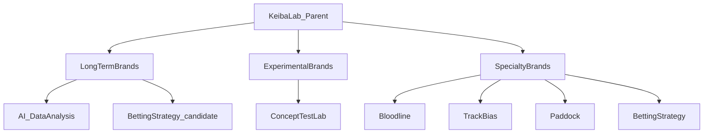

# Diagram — ブランド階層

```mermaid
flowchart TB
  parent[KeibaLab_Parent]
  parent --> longTerm[LongTermBrands]
  parent --> experimental[ExperimentalBrands]
  parent --> specialty[SpecialtyBrands]
  longTerm --> aiData[AI_DataAnalysis]
  longTerm --> strategy[BettingStrategy_candidate]
  experimental --> labX[ConceptTestLab]
  specialty --> blood[Bloodline]
  specialty --> bias[TrackBias]
  specialty --> paddock[Paddock]
  specialty --> strategy2[BettingStrategy]
```
