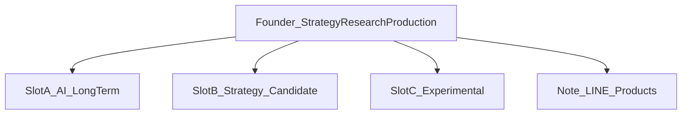
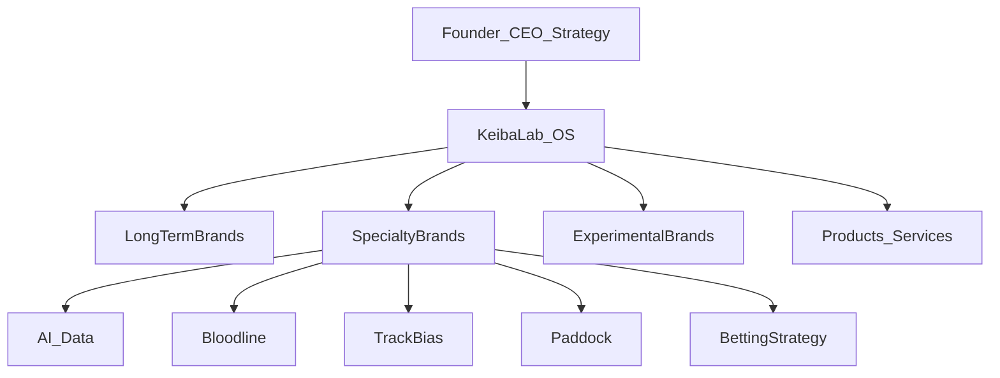

# Diagram — 組織（現在 → 将来）

## Now

```mermaid
flowchart TB
  founder[Founder_StrategyResearchProduction]
  founder --> slotA[SlotA_AI_LongTerm]
  founder --> slotB[SlotB_Strategy_Candidate]
  founder --> slotC[SlotC_Experimental]
  founder --> media[Note_LINE_Products]
```

## Future Media Group

```mermaid
flowchart TB
  founder[Founder_CEO_Strategy]
  founder --> labOS[KeibaLab_OS]
  labOS --> longTermGroup[LongTermBrands]
  labOS --> specialtyGroup[SpecialtyBrands]
  labOS --> experimentalGroup[ExperimentalBrands]
  labOS --> productGroup[Products_Services]
  specialtyGroup --> ai[AI_Data]
  specialtyGroup --> blood[Bloodline]
  specialtyGroup --> bias[TrackBias]
  specialtyGroup --> paddock[Paddock]
  specialtyGroup --> strategy[BettingStrategy]
```
