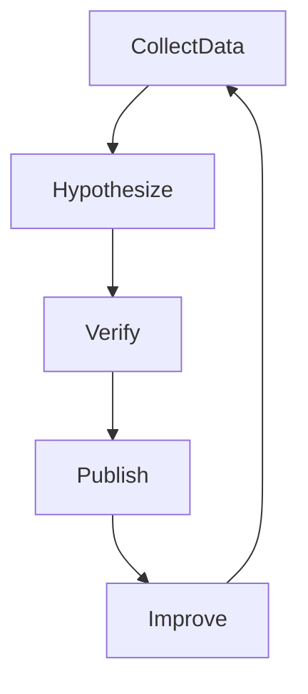

# Diagram — 研究サイクル

```mermaid
flowchart TD
  collect[CollectData] --> hypothesize[Hypothesize]
  hypothesize --> verify[Verify]
  verify --> publish[Publish]
  publish --> improve[Improve]
  improve --> collect
```

公開先:

- YouTube = 研究発表
- note = 研究レポート
- LINE = 速報
- 商品 = 研究成果
